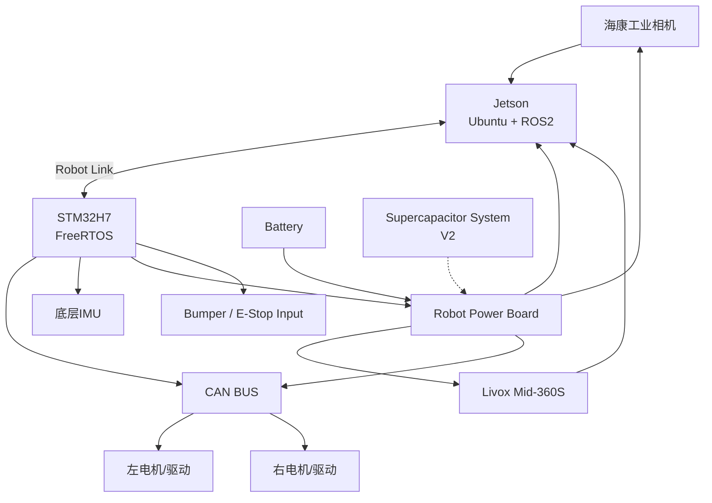
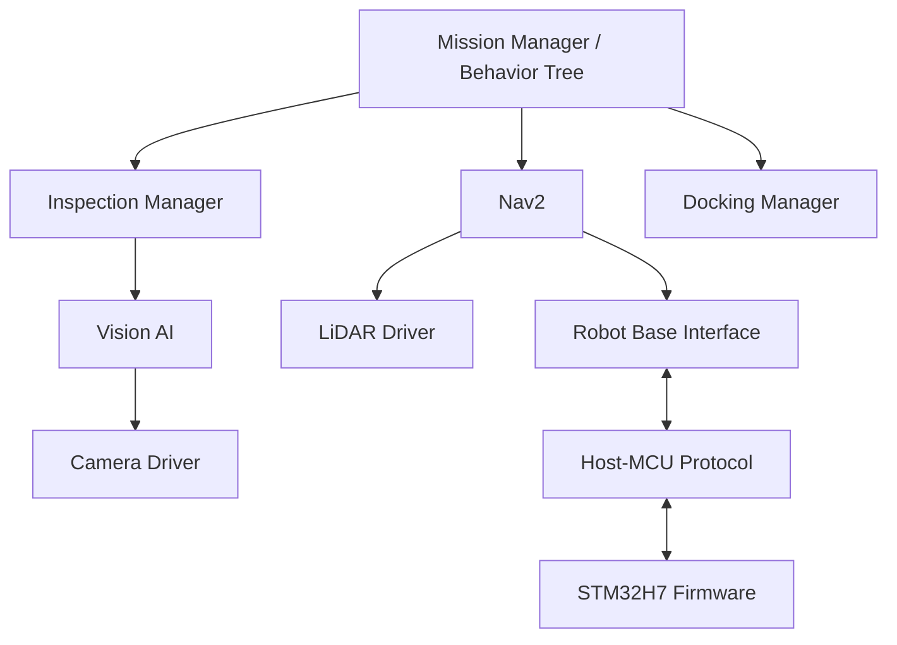
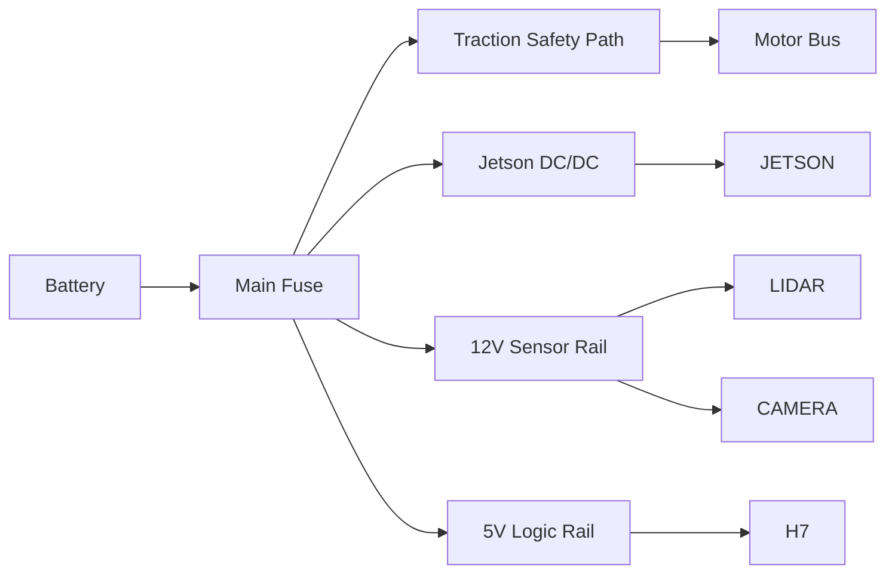
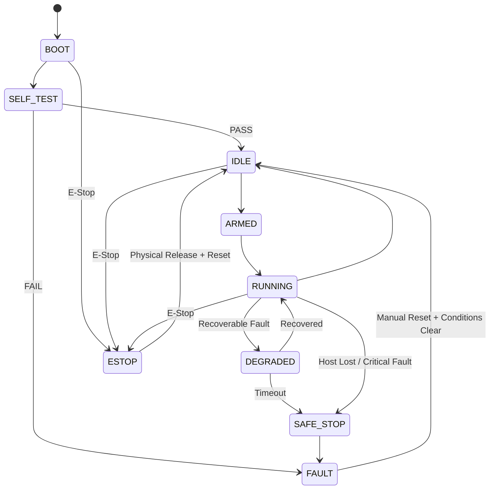

# LabSentinel 自主巡检·自诊断·能量感知移动机器人
## 系统工程技术方案与总体设计报告

**文档编号：LS-SYS-SDS-001**  
**版本：V1.0**  
**日期：2026-09-20**  
**项目周期建议：2026-09 ～ 2027-07 完成工程版；2027-09 ～ 毕业完成毕设研究版**  
**项目性质：个人长期机器人平台 / 求职旗舰项目 / 本科毕业设计基础平台**  
**目标岗位：机器人嵌入式、MCU/RTOS、机器人系统软件、Embedded Linux、智能硬件、工业控制**

---

# 文档修订记录

| 版本 | 日期 | 说明 |
|---|---|---|
| V1.0 | 2026-09-20 | 首版总体技术方案；定义系统边界、模块、接口、开发职责、验证指标和版本路线 |

---

# 摘要

本项目拟设计并实现一台面向实验室、机房、教学实验场地等半结构化室内环境的**自主巡检、分层安全、自诊断、可扩展、能量感知移动机器人**。

项目不是以“做一台能跑Nav2的小车”为目标，而是以工程产品思维建立一套长期可迭代的机器人系统平台。其核心设计思想为：

1. **双计算域架构**：  
   Jetson负责ROS2、导航、视觉AI、任务规划等高层计算；STM32H7负责电机实时控制、FreeRTOS任务调度、安全状态机、设备监测及关键故障处理。

2. **实时控制与非实时计算解耦**：  
   即使Jetson或ROS2节点异常，底层控制器仍可以独立完成超时检测、制动/停机、故障锁定等安全动作。

3. **模块化硬件与软件架构**：  
   底盘、传感器、AI、Dock、能量管理均以标准接口接入，使该平台后续可迁移到不同底盘、不同机器人任务。

4. **多模态感知闭环**：  
   利用已有Livox Mid-360S、海康工业相机、Jetson构建激光雷达+视觉感知系统，实现导航、巡检、目标识别与后期视觉/雷达精准Docking。

5. **主动巡检而非被动感知**：  
   相机安装于二自由度云台，在巡检点根据任务主动调整观测角度，实现设备状态识别、屏幕读取或目标确认。

6. **自诊断与Fault Injection**：  
   建立Host掉线、CAN电机掉线、LiDAR掉线、Camera掉线、低电压、Watchdog等故障模型，并通过主动故障注入测试验证系统行为。

7. **能量感知与超级电容扩展**：  
   在工程版机器人稳定后，将当前正在复现的双向Buck-Boost超级电容模块接入机器人直流母线，开展峰值功率缓冲、能量管理和Energy-aware任务策略研究，为本科毕设建立研究问题。

本项目中，**底层实时控制、安全体系、机器人通信协议、机器人电源管理板、ROS2机器人接口、巡检任务逻辑、测试系统、性能测量和系统集成由本人主导完成**；Livox官方驱动、ROS2、Nav2、ros2_control、TensorRT等成熟基础设施合理复用，避免无价值重复造轮子。

---

# 目录

1. 项目背景与定位  
2. 设计原则  
3. 竞品/参考平台与项目差异化  
4. 系统目标与非目标  
5. 系统需求规格  
6. 总体系统架构  
7. 模块责任边界：哪些自己做、哪些复用  
8. 机械结构系统  
9. 行走机构与驱动系统  
10. 电源与配电系统  
11. STM32H7实时控制器  
12. FreeRTOS软件架构  
13. 底盘控制与里程计  
14. Jetson-H7通信系统  
15. ROS2总体软件架构  
16. Livox Mid-360S激光雷达子系统  
17. 海康工业相机与主动云台  
18. YOLO / TensorRT巡检视觉子系统  
19. 定位、建图与Nav2导航  
20. 自主巡检任务系统  
21. 自动Docking系统  
22. 分层安全与Fault Management  
23. 日志、观测性与数据闭环  
24. Robot Power Board自研方案  
25. 超级电容与Energy-aware扩展  
26. Embedded Linux补充项目关系  
27. Git与配置管理  
28. AI辅助工程开发规范  
29. 测试与验证计划  
30. 项目阶段与版本路线  
31. 预算与BOM规划  
32. 风险分析  
33. 毕业设计扩展方向  
34. 求职简历映射  
35. 项目最终交付物  
36. 附录A：建议ROS2接口表  
37. 附录B：建议MCU通信协议  
38. 附录C：建议Fault Code体系  
39. 附录D：建议FreeRTOS任务表  
40. 附录E：测试记录模板  
41. 参考资料

---

# 1. 项目背景与定位

## 1.1 项目背景

当前个人已有以下技术和设备资源：

### 已有技术经历

- 中国机器人创意大赛轮式格斗擂台赛；
- RoboMaster哨兵机器人调试；
- STM32基础；
- FreeRTOS基本任务创建和运行；
- F4主控板原理图/PCB独立设计；
- 港科大2024超级电容复现经历，正在重新复现；
- OpenCV基础；
- Jetson平台YOLO目标检测部署；
- Linux基本操作；
- Makefile、make、gcc、gcc-arm基本概念。

### 已有关键设备

- Jetson；
- Livox Mid-360S；
- 海康工业相机；
- STM32H7主控板；
- RoboMaster电机、驱动器、机械资源；
- 双目相机；
- 正点原子ALPHA / i.MX6ULL Linux开发板；
- 实验室常用调试设备；
- 双系统Ubuntu/Windows电脑。

现有能力的主要问题不是资源不足，而是：

> 技术点较多，但没有一个长期实体平台把所有知识串起来。

因此，本项目的第一价值不是“创造一个世界上从不存在的机器人”，而是构建一个可以连续开发1～2年的**统一工程载体**。

---

## 1.2 项目定位

项目正式名称建议：

> **LabSentinel：基于STM32H7与ROS2的自主巡检、自诊断及能量感知移动机器人**

英文可写：

> **LabSentinel: A Hierarchical Real-Time, Self-Diagnostic and Energy-Aware Autonomous Inspection Robot**

---

## 1.3 最终应用场景

第一目标场景：

> **实验室自主巡检**

典型任务：

1. Robot从Dock启动；
2. 根据预设路线进入实验室；
3. 到达工位；
4. 主动云台调整相机角度；
5. 检查设备状态；
6. 识别某些目标或读取屏幕；
7. 保存图片/检测结果；
8. 继续下一巡检点；
9. 电量低或任务结束；
10. 返回Dock；
11. 后期实现精准Dock和自动充电；
12. 生成任务报告。

---

# 2. 设计原则

整个项目必须始终遵守以下原则。

## 2.1 原则一：工程闭环优先于技术堆叠

不以“我用了多少技术”为评价标准。

评价标准：

- 是否稳定；
- 是否可测；
- 是否可解释；
- 是否可维护；
- 是否有故障处理；
- 是否有测试证据；
- 是否可复现。

---

## 2.2 原则二：实时控制不依赖Linux正常工作

Jetson是高层智能计算机。

STM32H7是实时控制和安全控制核心。

必须保证：

> Jetson崩溃 ≠ 机器人失去最后安全控制。

---

## 2.3 原则三：成熟基础设施不重复造轮子

不自己重写：

- ROS2；
- DDS；
- Nav2；
- Livox驱动；
- TensorRT；
- YOLO训练框架；
- ros2_control核心；
- 通用图像驱动框架。

自己重点完成：

- 自己的机器人平台；
- 实时控制；
- 通信；
- Safety；
- 系统集成；
- ROS接口；
- Dock插件；
- 测试；
- 能量管理。

---

## 2.4 原则四：所有“性能”必须实测

禁止简历出现自己没有测量的数据。

例如：

- 控制周期1kHz：需要测；
- Jitter：需要测；
- ROS通信Latency：需要测；
- Dock成功率：需要测；
- YOLO FPS：需要测；
- 电池峰值电流：需要测；
- Supercap改善程度：需要测。

---

## 2.5 原则五：先完成V1，再优化V2

第一阶段：

> 能稳定运行。

第二阶段：

> 可维护、可靠、可测试。

第三阶段：

> 创新研究。

不要第一天就做所有高级功能。

---

# 3. 竞品/参考平台与项目差异化

## 3.1 商业/教育机器人已经有什么

成熟ROS2研究平台通常已经包含：

- SBC；
- STM32实时控制器；
- 电机；
- 编码器；
- IMU；
- LiDAR；
- ROS2；
- 电源管理；
- 可扩展传感器接口。

因此：

> “STM32 + Jetson + LiDAR + ROS2”本身不是创新。

---

## 3.2 本项目的差异化不放在“传感器数量”

核心差异化：

### 1. 分层安全

Jetson与H7职责清晰。

### 2. Fault Injection

主动验证系统如何失败。

### 3. 主动视觉巡检

不是固定摄像头拍到什么算什么。

### 4. 精准Dock

不是导航到充电站附近。

### 5. 能量感知

任务策略知道机器人当前电量和功率状态。

### 6. 超级电容

研究峰值功率缓冲。

### 7. 工程过程可审查

Git、测试、文档、版本、指标完整。

---

# 4. 系统目标与非目标

## 4.1 核心目标

### G1：可运行实体移动机器人

机器人必须长期在真实实验室地面运行。

### G2：实时底盘控制

H7独立完成底盘运动控制与关键Safety。

### G3：ROS2高层系统

Jetson完成：

- Perception；
- Navigation；
- Mission；
- Data Logging。

### G4：多传感器

接入：

- Mid-360S；
- Industrial Camera；
- Wheel Encoder；
- IMU。

### G5：自主巡检

从“导航”升级到“任务”。

### G6：精准Dock

V1实现精准停车；
V2实现充电接触。

### G7：自诊断

系统可以发现关键模块Offline。

### G8：可验证

建立系统测试报告。

### G9：毕设可扩展

支持后期：

- Supercapacitor；
- Energy-aware planning；
- Docking fusion；
- Fault-tolerant control。

---

## 4.2 非目标

第一阶段明确不做：

- 自研完整SLAM算法；
- 自研视觉大模型；
- 自研DDS；
- 高速无人车；
- 室外全天候IP等级机器人；
- 人形机器人；
- 六轴机械臂；
- VLA；
- 深度强化学习；
- 多机器人集群；
- 复杂3D路径规划；
- 安全认证级产品。

---

# 5. 系统需求规格

## 5.1 功能需求

### SYS-F-001

机器人应能接收速度命令并控制差速底盘。

### SYS-F-002

H7应周期性输出底盘状态。

### SYS-F-003

H7应监控Host Heartbeat。

### SYS-F-004

Host通信丢失时，应进入安全停止过程。

### SYS-F-005

机器人应发布Wheel Odometry。

### SYS-F-006

Jetson应接收Mid-360S点云数据。

### SYS-F-007

Jetson应接收海康相机图像。

### SYS-F-008

机器人应支持ROS2导航。

### SYS-F-009

机器人应支持巡检Waypoint任务。

### SYS-F-010

机器人应保存巡检图像及结果。

### SYS-F-011

机器人应支持故障状态上报。

### SYS-F-012

机器人应支持rosbag2记录关键数据。

### SYS-F-013

机器人应支持人工Emergency Stop。

### SYS-F-014

机器人应支持低电量Return-to-Dock。

### SYS-F-015

后期应支持视觉/雷达辅助精准Dock。

---

## 5.2 初步性能目标

注意：

> 以下全部是**Design Target**，不是已实现数据。

需要在项目后期根据实测更新。

| 指标 | 初始设计目标 |
|---|---|
| 室内最大软件限速 | 0.4～0.6 m/s |
| 底层MotorControl周期 | 1 ms目标 |
| Safety监控周期 | 2～5 ms或事件驱动+周期检查 |
| Host Command Timeout | 建议150～500 ms可配置 |
| Host失联进入安全动作 | <500 ms目标 |
| 连续运行稳定性 | ≥2 h无致命故障 |
| ROS2机器人状态发布 | 50～100 Hz |
| Wheel Odom发布 | 50～100 Hz |
| Power状态 | 10～20 Hz |
| LiDAR | 按官方驱动工作频率 |
| Camera | 根据分辨率和AI负载确定 |
| Dock成功率 | 后期目标≥90% / 20次以上测试 |
| Dock终态误差 | 后期目标x/y厘米级，Yaw数度级 |
| 巡检任务成功率 | 明确场景中≥90%目标 |

---

# 6. 总体系统架构

## 6.1 物理架构



---

## 6.2 软件架构



---

# 7. 模块责任边界：哪些自己做、哪些复用

这是本报告最重要的章节之一。

项目必须避免两个极端：

1. 什么都用开源Demo，自己没有工程贡献；
2. 什么都从零重写，时间完全不够。

---

## 7.1 模块责任总表

| 模块 | 方式 | 是否自己主导 | 说明 |
|---|---|---:|---|
| 机器人整机系统架构 | 自研 | ★★★★★ | 必须自己设计 |
| 底盘机械结构 | 自研/加工 | ★★★★☆ | 自己设计，外部加工 |
| STM32H7固件 | 自研 | ★★★★★ | 项目核心 |
| FreeRTOS任务架构 | 自研 | ★★★★★ | 项目核心 |
| Motor CAN Driver | 自研 | ★★★★★ | 基于设备协议自己实现 |
| Wheel Odometry | 自研 | ★★★★★ | 自己实现、验证 |
| Safety State Machine | 自研 | ★★★★★ | 最大亮点之一 |
| Fault Manager | 自研 | ★★★★★ | 项目核心 |
| Host-MCU通信协议 | 自研 | ★★★★★ | 必须自己设计 |
| Robot Power Board | 自研 | ★★★★★ | PCB差异化 |
| ROS2 Robot Base Node | 自研 | ★★★★★ | 必须自己写 |
| ros2_control Hardware Interface | V2自研 | ★★★★☆ | 在V1之后加入 |
| ROS2核心 | 复用 | — | 不重复造轮子 |
| Nav2 | 复用+配置 | ★★★☆☆ | 重点是系统集成和调参 |
| Mission Behavior Tree | 自研 | ★★★★★ | 体现机器人系统能力 |
| Livox Driver | 官方复用 | — | 使用Livox官方包 |
| LiDAR简单Filter/ROI Node | 自研 | ★★★★☆ | 自己实现 |
| 海康相机Driver | 官方SDK/已有驱动优先 | ★★★☆☆ | 不必重写SDK |
| Camera ROS2 Wrapper | 自研 | ★★★★☆ | 自己做ROS封装 |
| YOLO训练框架 | 复用 | — | 不自研网络 |
| 自建数据集 | 自己 | ★★★★★ | 必须自己做 |
| TensorRT部署封装 | 自研+官方API | ★★★★☆ | 自己做工程封装 |
| 云台结构 | 自研/购买舵机 | ★★★★☆ | 机械可加工 |
| 云台控制 | 自研 | ★★★★☆ | H7或Jetson控制 |
| Inspection Manager | 自研 | ★★★★★ | 项目业务核心 |
| Docking机械结构 | 自研 | ★★★★★ | 毕设价值高 |
| AprilTag等视觉库 | 复用 | — | 不重写Tag算法 |
| Dock Pose Estimation | 自研/集成 | ★★★★☆ | 重点做融合和闭环 |
| Dock Controller | 自研 | ★★★★★ | 自己设计、测试 |
| 自动充电电源 | 商用低压充电方案优先 | ★★★☆☆ | 不处理市电 |
| Logging | ROS工具复用+系统自研 | ★★★★☆ | 定义自己数据体系 |
| Test Harness | 自研 | ★★★★★ | 非常重要 |
| Fault Injection | 自研 | ★★★★★ | 项目差异化 |
| Supercap硬件 | 复现+二次开发 | ★★★★★ | 单独旗舰能力 |
| Energy Manager | 自研 | ★★★★★ | 毕设核心候选 |

---

## 7.2 “自己做”的定义

不是要求每一行代码从零写。

“自己做”应满足：

- 需求由你定义；
- 架构由你决定；
- 接口由你设计；
- 代码主体由你完成或深度理解；
- 测试由你制定；
- 问题由你定位；
- 结果由你测量；
- 文档由你编写。

---

# 8. 机械结构系统

## 8.1 底盘形式

首版强烈建议：

> **双轮差速 + 1～2个支撑轮**

而不是麦克纳姆。

原因：

- 运动学简单；
- 定位更容易；
- 轮式里程计质量高；
- 参数少；
- Nav2支持成熟；
- 更适合真正调算法/系统；
- 节约预算。

---

## 8.2 初步尺寸建议

| 参数 | 建议值 |
|---|---|
| 车体长度 | 280～340 mm |
| 车体宽度 | 240～300 mm |
| 主体高度 | 120～180 mm |
| LiDAR高度 | 300～450 mm |
| 轮径 | 80～120 mm |
| 总质量 | 约4～8 kg |
| 离地间隙 | ≥20 mm |
| 设计速度 | ≤0.6 m/s |

以上不是硬性指标，根据已有RM机械件调整。

---

## 8.3 结构层级

### Layer 0：底层

- 电池；
- 驱动轮；
- 大电流线路。

原则：

> 重心最低。

### Layer 1：控制和电源

- H7；
- Power Board；
- Motor Driver接口；
- E-Stop逻辑。

### Layer 2：计算平台

- Jetson；
- 网络交换/USB Hub（如需要）；
- 散热。

### Layer 3：传感器

- Mid-360S；
- Camera Gimbal。

---

## 8.4 LiDAR安装原则

Mid-360S顶部放置。

要求：

- 周围支架不能严重遮挡360°视场；
- 避免线束遮挡；
- 支架必须足够刚性；
- 固定坐标系清晰；
- CAD中记录安装外参初值。

Mid-360S官方规格显示其具备360°水平、59°垂直视场，尺寸约65×65×60 mm，重量约265 g，适合此类小型移动机器人。

---

## 8.5 机械接口标准化

建议自己建立机械安装孔规范。

例如：

### Sensor Deck

M3孔阵列：

- 20 mm pitch；
- 对称中心基准。

### Electronics Deck

使用：

- M3铜柱；
- 统一板卡安装区域。

以后换板子不用重新打孔。

---

# 9. 行走机构与驱动系统

## 9.1 推荐优先利用现有RM资源

如果实验室允许长期使用：

优先：

- M2006 + C610；
- 或M3508 + C620。

优点：

- CAN接口；
- 编码器反馈；
- RoboMaster已有经验；
- 减少预算；
- 非常适合练CAN和实时控制。

---

## 9.2 替代方案

如果RM电机无法长期使用：

使用：

- 两个37D / 520类编码减速直流电机；
- 双通道电机驱动器；
- 编码器反馈。

这条路线也完全可行。

---

## 9.3 驱动接口抽象

代码中不允许Control直接依赖某一个型号电机。

建议：

```text
Control
   ↓
Motor Service
   ↓
Motor Device Interface
   ↓
DJI Motor Driver / DC Motor Driver
```

例如：

```cpp
class MotorInterface {
public:
    virtual void set_velocity(float rad_s) = 0;
    virtual float get_velocity() const = 0;
    virtual float get_position() const = 0;
    virtual bool online() const = 0;
};
```

不需要一开始就真的用C++写MCU OOP，重点是理解抽象思想。

---

# 10. 电源与配电系统

## 10.1 电源设计原则

机器人电源设计比“接一个降压模块”复杂。

至少要区分：

### Traction Rail

电机动力。

### Compute Rail

Jetson。

### Sensor Rail

LiDAR / Camera。

### Logic Rail

H7 / Interface。

---

## 10.2 初版Power Tree



---

## 10.3 安全注意

不要让普通小型急停按钮直接承受超过其额定值的电池大电流。

正确方向：

- 使用额定匹配的DC断开器；
- 或急停控制适配电流的接触器/MOSFET/电源开关；
- 保留逻辑电源，使故障后仍可读取日志；
- 高功率切断方案必须根据实际电池、电机电流重新设计。

---

## 10.4 电池

如果RM电池可长期使用：

先复用。

否则选择有可靠BMS和充电器的成熟电池包。

第一阶段不要自制锂电池Pack。

---

# 11. STM32H7实时控制器

H7是整个机器人最应该“自己做深”的模块。

---

## 11.1 H7职责

必须负责：

- Motor Driver；
- Encoder；
- Chassis Control；
- FreeRTOS；
- Host Communication；
- Host Heartbeat；
- Safety；
- Device Online；
- Battery/Power采集；
- Watchdog；
- Fault Code；
- Low-level Logger。

不负责：

- YOLO；
- LiDAR Point Cloud；
- Nav2；
- Map；
- Global Planning。

---

## 11.2 H7软件分层

建议：

```text
Application
├─ Robot Application
├─ Safety Application
└─ System Monitor

Control
├─ Chassis Controller
├─ Velocity Controller
└─ Power Limiter

Service
├─ Motor Service
├─ Odometry Service
├─ Communication Service
├─ Power Service
└─ Fault Service

Device
├─ DJI Motor
├─ IMU
├─ Power Monitor
└─ Bumper

BSP
├─ CAN
├─ UART
├─ SPI
├─ I2C
├─ ADC
├─ Timer
└─ GPIO
```

---

# 12. FreeRTOS软件架构

## 12.1 初始任务建议

以下为设计起点，不是最终固定值。

| Task | 周期/触发 | 主要职责 |
|---|---|---|
| MotorControlTask | 1 kHz | 底盘实时控制 |
| ChassisStateTask | 500 Hz | 状态估计/里程计基础 |
| SafetyTask | 200～500 Hz | Safety检查 |
| CommRxTask | Event | Host数据解析 |
| CommTxTask | 100～500 Hz | 状态上传 |
| PowerTask | 50～100 Hz | 电压/电流/功率 |
| MonitorTask | 10～50 Hz | CPU/Stack/Device |
| LoggerTask | 低优先级 | 非实时日志 |

---

## 12.2 中断原则

ISR只做：

- 读必要寄存器；
- 存数据；
- 更新时间戳；
- `xTaskNotifyFromISR` / Queue；
- 必要的Yield。

不要在ISR：

- printf；
- 长计算；
- 复杂解析；
- 动态内存；
- 等待Mutex。

---

## 12.3 任务通信原则

### Queue

用于：

- 多条消息；
- Producer/Consumer；
- 完整数据传递。

### Task Notification

用于：

- 简单事件；
- ISR唤醒Task；
- 高效轻量同步。

### Mutex

用于：

- 共享资源互斥。

FreeRTOS官方说明Mutex带优先级继承，但不能认为它“解决了所有优先级反转”。

---

# 13. 底盘控制与里程计

## 13.1 差速运动学

定义：

- 左轮速度 \(v_l\)
- 右轮速度 \(v_r\)
- 轮距 \(L\)

机器人线速度：

\[
v = \frac{v_r + v_l}{2}
\]

角速度：

\[
\omega = \frac{v_r-v_l}{L}
\]

轮子目标：

\[
v_r = v + \frac{\omega L}{2}
\]

\[
v_l = v - \frac{\omega L}{2}
\]

---

## 13.2 必须自己做

- 编码器速度获取；
- Motor feedback；
- Wheel calibration；
- Wheel radius calibration；
- Wheelbase calibration；
- Odometry integration；
- 时间戳。

---

## 13.3 必须做的实验

### 实验A：直线

命令前进2m。

测：

- 实际距离；
- Odom距离。

### 实验B：原地旋转

旋转360°。

比较：

- 真实角度；
- Odom。

### 实验C：重复性

重复10次。

分析：

- Mean；
- Std；
- Drift。

这比只说“完成里程计”强得多。

---

# 14. Jetson-H7通信系统

## 14.1 推荐V1接口

优先选择一种：

### USB CDC / Virtual COM

简单、开发快。

或者：

### USB-UART

可靠，调试方便。

后期可转：

### Ethernet/UDP

如果希望统一网络接口。

---

## 14.2 不建议

一开始就直接上micro-ROS。

原因：

你现在需要先理解完整通信系统。

V1自己实现Protocol，V2再与micro-ROS比较。

---

## 14.3 通信协议框架

建议：

```text
SOF
Protocol Version
Message ID
Sequence
Timestamp
Payload Length
Payload
CRC16/CRC32
```

---

## 14.4 Message类型

至少：

- HEARTBEAT
- CMD_VELOCITY
- ROBOT_STATE
- MOTOR_STATE
- ODOM_STATE
- POWER_STATE
- FAULT_STATE
- PARAM_READ
- PARAM_WRITE
- LOG
- TIME_SYNC

---

## 14.5 可靠性

需要实现：

- CRC；
- Sequence；
- Timeout；
- Protocol Version；
- Invalid Packet Counter；
- RX Overflow Counter；
- Heartbeat。

---

## 14.6 测试

模拟：

- 丢字节；
- CRC错误；
- Sequence jump；
- Host停止；
- 高频命令；
- 超长数据。

---

# 15. ROS2总体软件架构

## 15.1 ROS2发行版

根据Jetson实际JetPack/Ubuntu决定。

不要为了追最新ROS2破坏稳定Jetson环境。

常见：

- Ubuntu 22.04 → ROS2 Humble；
- Ubuntu 24.04 → ROS2 Jazzy。

Livox官方驱动当前同时给出了ROS2 Humble与Jazzy支持路径。

---

## 15.2 Package设计

建议Workspace：

```text
labsentinel_ws/
src/
├─ labsentinel_description
├─ labsentinel_bringup
├─ labsentinel_msgs
├─ labsentinel_base
├─ labsentinel_safety
├─ labsentinel_power
├─ labsentinel_inspection
├─ labsentinel_docking
├─ labsentinel_vision
├─ labsentinel_lidar_tools
└─ labsentinel_mission
```

---

## 15.3 labsentinel_description

包含：

- URDF/Xacro；
- TF；
- Mesh；
- Sensor Frames；
- Robot Footprint。

---

## 15.4 labsentinel_base

负责：

- Serial/Ethernet；
- Protocol Parser；
- `/cmd_vel`；
- `/odom`；
- `/robot_state`；
- `/fault_state`。

---

## 15.5 ROS2接口选择原则

ROS2官方建议：

### Topic

用于连续数据：

- Sensor；
- Robot State；
- Odom；
- Power。

### Service

用于快速请求：

- Reset Fault；
- Set LED；
- Read Param。

### Action

用于耗时任务：

- Dock；
- Inspect Station；
- Execute Mission。

---

# 16. Livox Mid-360S激光雷达子系统

## 16.1 设备能力

根据Livox官方当前规格，Mid-360S具备：

- 360°水平FOV；
- 59°垂直FOV；
- 0.1m近处盲区；
- 40m@10%反射率典型量程；
- 200,000 points/s；
- 100BASE-TX；
- 内置IMU；
- 9～27V供电；
- 约6.5W；
- 265g。

因此非常适合该项目。

---

## 16.2 是否自己写Driver

**不写。**

复用：

> Livox官方livox_ros_driver2。

当前官方驱动已经包含Mid360S配置和ROS2支持。

---

## 16.3 自己应该做什么

你负责：

- Network配置；
- Driver Build；
- ROS2 Launch；
- Frame ID；
- Extrinsic；
- PointCloud Topic；
- rosbag；
- Data Monitor；
- 故障检测；
- Point Cloud工具节点。

---

## 16.4 自己写一个LiDAR工具节点

功能：

- Crop ROI；
- Height Filter；
- Near Robot Filter；
- 点数统计；
- 最小障碍距离；
- 发布Diagnostic。

它不必复杂，但必须是你自己的代码。

---

# 17. 海康工业相机与主动云台

## 17.1 Camera定位

主要用途：

- Inspection；
- YOLO；
- OCR；
- Dock视觉。

---

## 17.2 为什么做云台

固定相机的问题：

机器人必须改变整个车姿态才能获得最佳视角。

主动云台允许：

> Base Pose基本不变，Camera主动调整Observation Pose。

---

## 17.3 机械

2DOF：

- Yaw；
- Pitch。

第一版可直接购买舵机。

自己做：

- CAD支架；
- 线束；
- 零位；
- 限位；
- 标定。

---

## 17.4 控制

可以：

Jetson → ROS2 → H7 → PWM Servo。

或者：

Jetson直接USB控制器。

更推荐：

> H7统一管理执行器。

---

## 17.5 软件接口

Topic：

`/gimbal/state`

Command：

`/gimbal/target`

后期可改Action：

`LookAtTarget.action`

---

# 18. YOLO / TensorRT巡检视觉子系统

## 18.1 训练目标

不要再只部署别人模型。

必须自己完成：

```text
采集
→ 标注
→ Train
→ Validate
→ ONNX
→ TensorRT
→ ROS2
→ 实车
```

---

## 18.2 数据集建议

场景不需要很大。

选4～8个真正有实验室意义的类别。

例如：

- power_supply_on
- power_supply_off
- battery_present
- battery_missing
- person
- blocked_path
- robot
- fire_extinguisher

不要一次标50类。

---

## 18.3 屏幕读取路线

V2可以做：

1. YOLO定位仪表/显示屏；
2. Perspective Transform；
3. OpenCV；
4. OCR；
5. 结构化输出。

---

## 18.4 TensorRT

NVIDIA官方推荐的典型路径就是：

> Model → ONNX → 选择FP32/FP16/INT8 → TensorRT Engine → Runtime。

你应该记录：

- Model size；
- FP32/FP16；
- FPS；
- Latency；
- GPU Memory；
- Accuracy。

---

# 19. 定位、建图与Nav2导航

## 19.1 原则

SLAM不是这个项目的原创核心。

因此：

> 使用成熟SLAM / Localization方案。

你需要理解和调试，而不是重写。

---

## 19.2 推荐路线

### Phase A

只完成：

- `/odom`
- TF
- Point Cloud
- Teleop

### Phase B

完成Localization/Mapping。

可以选择：

- 现有LiDAR-Inertial方案；
- 或适合Nav2的2D Map方案。

### Phase C

加入Nav2。

---

## 19.3 Nav2在项目中的作用

Nav2成熟框架本身提供：

- Planning；
- Control；
- Localization integration；
- Obstacle avoidance；
- Behavior；
- Behavior Tree。

你的重点：

- Robot Footprint；
- Costmap；
- Planner；
- Controller；
- Recovery；
- Velocity limit；
- Sensor integration；
- Mission integration。

---

## 19.4 不应把“跑通Nav2”写成最大亮点

最大的亮点应是：

- H7实时系统；
- Safety；
- Fault Management；
- Dock；
- Energy；
- 自己的Mission。

---

# 20. 自主巡检任务系统

## 20.1 Mission不是Navigation

Navigation只回答：

> 怎么去A点。

Mission回答：

> 为什么去A点，到A点干什么，失败怎么办，然后去哪。

---

## 20.2 巡检点配置

YAML：

```yaml
stations:
  - id: station_01
    pose:
      x: 2.10
      y: 1.30
      yaw: 1.57
    gimbal:
      yaw: 0.2
      pitch: -0.15
    tasks:
      - detect_device_state
      - capture_image

  - id: station_02
    pose:
      x: 4.50
      y: 2.20
      yaw: 0.0
    tasks:
      - check_blockage
```

---

## 20.3 Mission State

```text
IDLE
↓
PRECHECK
↓
NAVIGATING
↓
ALIGNING
↓
INSPECTING
↓
RECORDING
↓
NEXT_STATION
↓
RETURN_HOME
↓
DOCKING
↓
COMPLETE
```

---

## 20.4 行为树

后期推荐用BT管理。

原因：

Nav2本身大量使用Behavior Tree，适合复杂可恢复任务。

---

# 21. 自动Docking系统

这是最适合作为毕设子方向之一的模块。

---

## 21.1 V1：Non-Charging Dock

先不要自动充电。

目标：

> 自主精准停靠。

---

## 21.2 Dock机械设计

建议：

- V型导向；
- U型限位；
- AprilTag；
- 清晰几何特征。

第一版要“容易成功”。

不要为了美观把Dock做得很难识别。

---

## 21.3 Dock流程

```text
Nav2到Pre-Dock Pose
↓
Dock Perception Enable
↓
检测Dock
↓
估计相对Pose
↓
低速Approach
↓
Fine Alignment
↓
Contact / Position Confirm
↓
Dock Complete
```

---

## 21.4 V1感知

最简单：

> AprilTag + Camera。

目标是先完成闭环。

---

## 21.5 V2感知

加入：

- LiDAR Dock Geometry；
- Vision/LiDAR一致性；
- 遮挡鲁棒性。

---

## 21.6 Nav2 Docking

Nav2目前已有Docking Server框架，可以用于Charging/Non-Charging Dock并通过插件适配具体机器人。

因此你可以：

> 复用Docking Server框架，但自己实现LabSentinel Dock Plugin / Pose Detection / Control逻辑。

这比自己从头造完整Action系统更专业。

---

# 22. 分层安全与Fault Management

这是整个项目最重要的原创模块之一。

---

## 22.1 Safety原则

高层智能不能成为最后一道安全保证。

分层：

### L0：物理

- E-Stop；
- Fuse；
- Power Cut；
- Bumper。

### L1：MCU

- Command Timeout；
- Motor Offline；
- Watchdog；
- Undervoltage；
- Control Limit。

### L2：ROS

- LiDAR Offline；
- Camera Offline；
- Node Lifecycle；
- Navigation Failure。

### L3：Mission

- Retry；
- Skip；
- Return Home；
- Abort。

---

## 22.2 H7安全状态机



---

## 22.3 Fault分级

### INFO

不影响功能。

### WARNING

功能下降。

例如：

Camera Offline。

机器人仍可导航，但不能巡检视觉任务。

### CRITICAL

运动相关关键故障。

例如：

- Host Timeout；
- LiDAR failure during autonomous navigation；
- Motor Fault；
- Battery critical。

### ESTOP

立即进入人工紧急状态。

---

## 22.4 Fault Injection

必须主动测试。

例如：

- 拔Camera；
- 关闭LiDAR；
- kill ROS Node；
- 停止Host Heartbeat；
- 拔一个Motor CAN；
- 制造CRC错误；
- 模拟Low Battery。

---

# 23. 日志、观测性与数据闭环

没有日志的机器人很难工程化。

---

## 23.1 MCU日志

不要无限printf。

建议分级：

- DEBUG；
- INFO；
- WARN；
- ERROR；
- FATAL。

---

## 23.2 MCU Runtime Metrics

至少：

- Task Stack；
- Loop execution time；
- CAN error；
- Packet CRC error；
- Host timeout count；
- Motor offline count；
- Reset reason；
- Fault history。

---

## 23.3 ROS日志

使用：

- ROS logger；
- rosbag2；
- Topic statistics（合适时）；
- 自己的system status。

---

## 23.4 rosbag2记录

测试时至少记录：

- `/tf`
- `/tf_static`
- `/odom`
- `/cmd_vel`
- LiDAR
- Camera（必要时压缩）
- Robot state
- Fault
- Power
- Dock state

---

# 24. Robot Power Board自研方案

推荐自己做。

原因：

它能把你的硬件能力和机器人系统真正结合。

---

## 24.1 V1目标

Robot Power & Interface Board。

---

## 24.2 输入

- Battery。

---

## 24.3 输出

建议：

- Motor Bus；
- Jetson Rail；
- 12V Sensor；
- 5V Logic。

注意：

高功率DC/DC是否自己设计，需要根据能力决定。

V1更建议：

> Power Board完成保护、分配、测量、开关；DC/DC模块可使用成熟模块。

这样成功率更高。

---

## 24.4 监控

建议：

- Battery Voltage；
- Battery Current；
- Bus Voltage；
- Temperature；
- Rail Power Good。

---

## 24.5 控制

H7控制：

- Camera Power；
- LiDAR Power；
- Auxiliary Power；
- Fault latch。

Jetson电源不要轻易由普通软件直接切断。

---

## 24.6 电流检测

可以选择：

- INA226类数字功率监测；
- Shunt + Amplifier + ADC。

第一版数字监测更容易完成。

---

## 24.7 PCB输出成果

必须包含：

- Schematic；
- PCB；
- Gerber；
- BOM；
- Power Tree；
- Current Budget；
- Bring-up Checklist；
- 测试报告。

---

# 25. 超级电容与Energy-aware扩展

这部分放到机器人V1稳定之后。

---

## 25.1 不允许

Supercap直接并联Battery。

---

## 25.2 架构

```text
Battery
   │
DC Bus ─────────── Motor / Compute
   │
Bidirectional Buck-Boost
   │
Supercapacitor
```

---

## 25.3 研究目标

当机器人快速加速：

Battery Only：

- Battery current peak高；
- Bus droop可能更明显。

Battery + Supercap：

- Supercap承担瞬态Peak Power；
- Battery current更平滑。

---

## 25.4 必测指标

- Battery Peak Current；
- Battery RMS Current；
- Bus minimum voltage；
- Supercap current；
- Acceleration；
- Energy consumption；
- Converter efficiency；
- Temperature。

---

## 25.5 Energy Manager

后期Jetson/H7都知道：

- Battery SOC；
- Battery Power；
- Supercap SOC/Energy；
- Motor power。

策略：

```text
Normal
Low Energy
Return Home
Power Limited
Supercap Boost
Charging
```

---

# 26. Embedded Linux补充项目关系

i.MX6ULL不建议强行装进这台机器人。

理由：

Jetson已经承担Linux计算。

ALPHA板继续作为：

> Embedded Linux Driver专项训练平台。

最终简历：

- Robot项目：系统工程；
- Supercap：硬件/电力电子；
- i.MX6ULL：Linux底层。

三个项目功能不重复。

---

# 27. Git与配置管理

Git必须从项目第一天使用。

---

## 27.1 推荐仓库

如果一人开发，可以先Monorepo：

```text
LabSentinel/
├─ README.md
├─ docs/
├─ mechanical/
├─ hardware/
├─ firmware/
├─ ros2_ws/
├─ ai/
├─ tools/
├─ tests/
└─ logs/
```

后期项目成熟可拆Repo。

---

## 27.2 docs

```text
docs/
├─ requirements/
├─ architecture/
├─ interface-control/
├─ test/
├─ bug-log/
├─ decisions/
└─ images/
```

---

## 27.3 ADR

建议记录Architecture Decision Record。

例如：

`ADR-001-differential-drive.md`

内容：

- 为什么选择差速；
- 为什么不选Mecanum；
- Consequence。

这特别像真正工程项目。

---

## 27.4 Branch

```text
main
develop
feature/*
fix/*
experiment/*
```

个人项目可以简化，但不能所有内容都直接乱提交main。

---

## 27.5 Commit

推荐：

```text
feat(safety): add host heartbeat timeout state
fix(can): recover motor feedback after bus-off
test(control): add 1kHz loop jitter measurement
docs(icd): define robot state packet v0.2
```

---

## 27.6 Release

建议：

- v0.1-drive
- v0.2-rtos
- v0.3-host-link
- v0.4-ros2
- v0.5-lidar
- v0.6-navigation
- v0.7-inspection
- v0.8-safety
- v0.9-docking
- v1.0-engineering-demo
- v2.0-graduation-research

---

# 28. AI辅助工程开发规范

AI应该被当成：

> Engineer Copilot，而不是替代思考。

---

## 28.1 AI参与需求分析

让AI检查：

- Requirements是否模糊；
- 是否可测试；
- 是否缺异常情况。

例如：

不好：

> 机器人通信应当稳定。

改成：

> Host连续300ms未发送有效Heartbeat时，H7进入Safe Stop。

---

## 28.2 AI参与代码Review

给AI：

- Code；
- Context；
- Thread Model；
- ISR/Task；
- Memory Constraints。

让它检查：

- Race；
- Overflow；
- Blocking；
- Null；
- Real-time；
- Error Path。

---

## 28.3 AI参与Debug

格式：

```text
Observed:
Expected:
Recent Changes:
Measured:
Hypotheses already tested:
```

要求AI输出：

| Hypothesis | Why | Test | Expected Evidence |
|---|---|---|---|

---

## 28.4 AI参与测试设计

尤其：

- Fault Injection；
- Boundary；
- Stress；
- Long-run；
- Timeout；
- Disconnect；
- Corrupt packet。

---

## 28.5 AI参与ROS2

可以：

- 检查QoS选择；
- 检查Node职责；
- 检查死锁；
- 检查CMake；
- 生成测试框架。

不能：

> AI生成一个包，能编译就不再理解。

---

## 28.6 AI参与毕设

可以：

- 整理论文结构；
- 生成实验矩阵草稿；
- 帮助统计；
- 帮助审阅语言。

禁止：

- 虚构实验；
- 虚构参考文献；
- 虚构指标。

---

# 29. 测试与验证计划

工程项目必须把测试提前设计。

---

## 29.1 测试层级

### Unit

模块。

### Integration

两个模块。

### System

整机。

### Fault Injection

主动失败。

### Endurance

长时间。

---

## 29.2 MCU测试

| ID | 测试 | 方法 |
|---|---|---|
| MCU-T01 | Control周期 | DWT/GPIO+Scope |
| MCU-T02 | Jitter | Logic Analyzer |
| MCU-T03 | Stack | High Water Mark |
| MCU-T04 | Watchdog | 故意阻塞 |
| MCU-T05 | CAN Offline | 拔设备 |
| MCU-T06 | CRC | 注入错误Packet |
| MCU-T07 | Host Timeout | 停止Host |

---

## 29.3 底盘测试

| ID | 测试 |
|---|---|
| BASE-T01 | 1m直线 |
| BASE-T02 | 2m直线 |
| BASE-T03 | 360°旋转 |
| BASE-T04 | 低速跟踪 |
| BASE-T05 | 不同负载 |
| BASE-T06 | 紧急停止 |
| BASE-T07 | 斜坡/门槛（安全范围） |

---

## 29.4 ROS2测试

- Topic frequency；
- Topic age；
- Packet loss；
- Restart；
- Node crash；
- rosbag replay。

---

## 29.5 AI测试

按Lighting划分：

- Bright；
- Normal；
- Dark。

按Angle：

- Front；
- 15°；
- 30°。

按Distance：

- 0.5m；
- 1.0m；
- 1.5m。

输出Confusion Matrix。

---

## 29.6 Dock测试

至少20次。

记录：

- Start pose；
- Success；
- Time；
- x error；
- y error；
- yaw error；
- Failure reason。

---

## 29.7 Endurance

目标：

机器人连续运行2小时。

记录：

- CPU温度；
- Jetson内存；
- H7 Stack；
- ROS节点；
- Communication errors；
- Motor temperature（可测时）；
- Battery。

---

# 30. 项目阶段与版本路线

## Phase 0：需求与结构

**周期：1～2周**

完成：

- Requirements；
- CAD草图；
- Architecture；
- BOM；
- Git Repo。

验收：

> 不买无明确用途的器件。

---

## Phase 1：底盘V0.1

**周期：2～4周**

完成：

- 机械底盘；
- H7；
- Motor；
- CAN；
- Teleop。

验收：

> 不依赖Jetson也能安全控制运动。

---

## Phase 2：RTOS与Safety V0.2

**周期：3～4周**

完成：

- FreeRTOS；
- Task；
- Fault；
- Watchdog；
- Motor Offline；
- Heartbeat模拟。

验收：

> 可故意制造Host Lost并安全停车。

---

## Phase 3：Jetson-H7 V0.3

完成：

- Protocol；
- CRC；
- ROS2 base node；
- `/cmd_vel`；
- `/odom`。

---

## Phase 4：LiDAR/Navigation V0.5-V0.6

完成：

- Mid360S；
- TF；
- Localization；
- Nav2；
- Waypoint。

---

## Phase 5：Inspection V0.7

完成：

- Camera；
- Gimbal；
- YOLO；
- Inspection station。

---

## Phase 6：System Safety V0.8

完成：

- Fault Injection；
- Degraded Mode；
- Logs；
- Test Report。

---

## Phase 7：Dock V0.9

完成：

- Dock；
- Visual pose；
- Controller；
- 20次测试。

---

## Phase 8：Engineering V1.0

完成：

- 线束；
- 外壳；
- README；
- Demo；
- Test；
- Resume。

---

## Phase 9：毕业设计V2.0

选择：

- Supercap；
- Dock fusion；
- Energy-aware；
- Fault tolerant。

---

# 31. 预算与BOM规划

以下按已有：

- Jetson；
- Mid360S；
- Camera；
- H7；
- 一定RM资源；

进行预算。

价格是**规划预算，不是实时商城报价**。

---

## 31.1 预算方案A：最大化复用RM资源

| 项目 | 预算 |
|---|---:|
| 铝板/型材/结构 | 120～180 |
| 轮子/轴套/万向轮 | 60～100 |
| Power Board PCB+器件 | 100～160 |
| DC/DC与电源模块 | 80～130 |
| 保险/急停/连接器/线束 | 60～100 |
| 云台舵机/结构 | 80～130 |
| Dock结构 | 50～100 |
| 3D打印 | 50～100 |
| 杂项 | 50～100 |
| **合计** | **约650～1100** |

通过复用已有器件，1000元基本可实现。

---

## 31.2 如果必须买电机

增加：

- 两个编码电机；
- 驱动器。

这时建议：

> 第一阶段暂缓云台或Dock中的非必要结构，把预算优先放到底盘可靠性。

---

## 31.3 购买优先级

### P0

- 底盘；
- 电机；
- 电源；
- E-Stop；
- 线束。

### P1

- PDB；
- 云台。

### P2

- Dock。

### P3

- 外壳美化。

---

# 32. 风险分析

## 32.1 技术风险

### R1：项目过大

Probability：High  
Impact：High

Mitigation：

- 按Version交付；
- 每个Version可独立展示。

---

### R2：Jetson环境依赖混乱

Mitigation：

- 固定JetPack；
- 固定ROS2；
- 写Environment.md；
- Docker后期再加。

---

### R3：MID360S驱动/网络

Mitigation：

- 先单独完成Viewer/ROS；
- 固定IP；
- 把LiDAR独立成子系统验收。

---

### R4：机械结构反复改

Mitigation：

- 先纸面/CAD；
- 模块化孔位；
- 传感器板独立。

---

### R5：供电噪声/掉电

Mitigation：

- 分Rail；
- Power Budget；
- Scope测母线；
- 不使用廉价未知DC/DC承载关键负载。

---

### R6：超级电容拖垮主项目

Mitigation：

> Supercap严格放在V1机器人完成之后集成。

---

## 32.2 项目管理风险

最大的风险：

> 一边做机器人，一边又去学FPGA、双目、强化学习、Cadence、Zephyr……

Mitigation：

任何新技术问：

1. 是否解决当前Issue？
2. 是否进入V1验收？
3. 是否目标JD高频出现？

三者都不是：

> Backlog。

---

# 33. 毕业设计扩展方向

机器人平台完成后，毕业设计不能只写：

> “基于ROS2的巡检机器人设计。”

太普通。

应选择一个深问题。

---

## 33.1 方向A：Battery-Supercap

推荐指数：★★★★★

题目示例：

> 《基于电池-超级电容混合储能的自主移动机器人能量管理系统设计与实验研究》

研究：

- Peak Power；
- Battery stress；
- Power split；
- Control；
- Energy。

---

## 33.2 方向B：Vision-LiDAR Docking

★★★★★

题目：

> 《基于视觉与三维激光雷达融合的移动机器人精准自主对接方法设计》

研究：

- Vision；
- LiDAR；
- Pose；
- Dock Controller；
- Robustness。

---

## 33.3 方向C：Fault-Tolerant Hierarchical Control

★★★★☆

题目：

> 《面向移动机器人的分层实时控制与故障安全机制设计》

研究：

- Host/MCU split；
- Heartbeat；
- Failure；
- Recovery；
- Fault Injection。

---

## 33.4 方向D：Energy-aware Mission

★★★★☆

题目：

> 《面向自主巡检机器人的能量感知任务规划方法研究》

研究：

- Distance；
- Speed；
- Battery；
- Energy model；
- Return-to-Dock。

---

# 34. 求职简历映射

项目最终简历标题：

> **基于STM32H7/FreeRTOS与ROS2的自主巡检移动机器人**

可以体现：

### Firmware

- STM32H7；
- FreeRTOS；
- CAN；
- Motor；
- Watchdog；
- Fault。

### System

- Jetson；
- Linux；
- ROS2；
- C++；
- Nav2；
- ros2_control。

### Perception

- Mid360S；
- Industrial Camera；
- YOLO；
- TensorRT。

### Hardware

- PCB；
- Power；
- Current Sensing；
- E-Stop。

### Engineering

- Git；
- Architecture；
- Protocol；
- Test；
- Fault Injection。

---

# 35. 项目最终交付物

不是只有一台机器人。

必须有：

## Mechanical

- CAD；
- BOM；
- Assembly Drawing。

## Hardware

- Schematic；
- PCB；
- BOM；
- Power Tree；
- Bring-up。

## Firmware

- Source；
- Architecture；
- RTOS Task Design；
- Protocol。

## ROS

- Packages；
- Launch；
- URDF；
- Config。

## AI

- Dataset说明；
- Training配置；
- Metrics；
- TensorRT Benchmark。

## Test

- Unit；
- Integration；
- System；
- Fault；
- Dock；
- Endurance。

## Docs

- README；
- System Design；
- ICD；
- ADR；
- Bug Log；
- Test Report。

## Media

- Demo视频；
- 波形；
- RViz；
- 实车照片。

---

# 36. 附录A：建议ROS2接口表

## Topics

| Topic | Type/内容 | Rate | Owner |
|---|---|---:|---|
| `/cmd_vel` | Velocity Command | 按需/20～100Hz | Nav/Base |
| `/odom` | Odometry | 50～100Hz | Base |
| `/robot_state` | Robot State | 20～50Hz | Base |
| `/fault_state` | Fault | Event+周期 | Safety |
| `/power/state` | Power | 10～20Hz | Power |
| `/gimbal/state` | Gimbal | 20Hz | Gimbal |
| `/inspection/result` | Inspection | Event | Inspection |
| `/dock/state` | Dock State | Event+周期 | Dock |
| `/lidar/points` | PointCloud | Driver | Livox |
| `/camera/image` | Image | Camera FPS | Camera |

---

## Services

- `/robot/reset_fault`
- `/robot/arm`
- `/power/get_status`
- `/inspection/reload_config`

---

## Actions

- `/mission/execute`
- `/inspection/inspect_station`
- `/dock/dock`
- `/dock/undock`

---

# 37. 附录B：建议MCU通信协议

## Header

```c
typedef struct {
    uint16_t sof;
    uint8_t  version;
    uint8_t  msg_id;
    uint16_t seq;
    uint32_t timestamp_ms;
    uint16_t payload_len;
} packet_header_t;
```

尾部：

```text
Payload
CRC
```

---

## Message ID示例

| ID | Message |
|---:|---|
| 0x01 | HEARTBEAT |
| 0x02 | CMD_VELOCITY |
| 0x10 | ROBOT_STATE |
| 0x11 | ODOM |
| 0x12 | MOTOR_STATE |
| 0x13 | POWER_STATE |
| 0x14 | FAULT_STATE |
| 0x20 | PARAM_SET |
| 0x21 | PARAM_GET |

最终ID自行整理。

---

# 38. 附录C：建议Fault Code体系

使用32bit：

```text
[31:28] Severity
[27:24] Domain
[23:16] Device
[15:0]  Specific Code
```

Domain：

- POWER
- MOTOR
- COMM
- SENSOR
- RTOS
- CONTROL
- HOST

示例：

```text
COMM_HOST_TIMEOUT
MOTOR_LEFT_OFFLINE
MOTOR_RIGHT_OFFLINE
POWER_BATTERY_LOW
POWER_BATTERY_CRITICAL
SENSOR_LIDAR_OFFLINE
SENSOR_CAMERA_OFFLINE
RTOS_STACK_LOW
```

---

# 39. 附录D：建议FreeRTOS任务表

| Task | Prio | Stack | Trigger | Deadline | Notes |
|---|---:|---:|---|---|---|
| MotorControl | High | 实测 | 1ms | <1ms | 核心实时 |
| Safety | High | 实测 | 2～5ms | 明确 | 关键 |
| CommRx | High/Med | 实测 | Event | 短 | Parser |
| ChassisState | Med | 实测 | 2ms | — | Odom |
| Power | Med/Low | 实测 | 10～20ms | — | ADC/I2C |
| CommTx | Med | 实测 | 周期 | — | State |
| Monitor | Low | 实测 | 100ms | — | Runtime |
| Logger | Lowest | 实测 | Event | 无硬deadline | 不阻塞 |

不要照搬Stack数字。

使用：

> High Water Mark实测。

---

# 40. 附录E：测试记录模板

```markdown
# Test Case

ID:
Name:
Version:
Date:
Operator:

## Objective

## Setup

Hardware:
Firmware:
ROS commit:
Environment:

## Procedure
1.
2.
3.

## Expected

## Result

## Data

## Evidence
- oscilloscope:
- rosbag:
- log:
- photo:

## PASS / FAIL

## Issues

## Conclusion
```

---

# 41. 参考资料

本方案设计时主要核对以下当前官方或一手资料：

1. **Livox Mid-360S 官方产品页与规格页**  
   用途：Mid-360S尺寸、FOV、点频、供电、以太网、IMU等工程参数。

2. **Livox-SDK / livox_ros_driver2 官方仓库**  
   用途：确认Mid360S、ROS2 Humble/Jazzy相关支持及配置方式。

3. **ROS 2 官方文档：Topics / Services / Actions**  
   用途：ROS2接口设计原则。

4. **Nav2 官方文档**  
   用途：Navigation、Behavior Tree、Docking Server、Collision Monitor等系统边界。

5. **ros2_control 官方文档**  
   用途：Hardware Component、Controller Manager、read/write接口与Hardware Abstraction设计。

6. **FreeRTOS 官方文档**  
   用途：Task State、Mutex、Priority Inheritance等实时系统设计依据。

7. **NVIDIA TensorRT 官方文档**  
   用途：ONNX→TensorRT、FP32/FP16/INT8部署路径。

8. **Husarion ROSbot XL 官方文档**  
   用途：参考成熟教育/研发AMR在STM32+SBC、电源管理、传感器扩展方面的系统设计方式。

9. **Robotnik RB-WATCHER 官方资料**  
   用途：确认巡检机器人商业系统已普遍集成3D LiDAR、RGB-D/视觉、自动任务与Dock等功能，从而明确本项目的创新重点不应只放在“有导航和摄像头”。

---

# 结论

LabSentinel最重要的价值并不是做出一台“功能很多”的小车。

真正目标是建立一台：

> **你能够从电池、电源、PCB、STM32、FreeRTOS、CAN、实时控制，一路追踪到Linux、ROS2、LiDAR、Camera、AI、Navigation和Mission的完整机器人。**

系统出现任何问题时，你应该逐渐具备这种判断：

```text
机器人不动
↓
是Mission没有发Command？
↓
Nav2没有输出？
↓
Base Node没有发包？
↓
USB/Protocol错误？
↓
H7进入FAULT？
↓
Motor CAN Offline？
↓
Power Bus异常？
```

然后使用：

- ROS2 CLI；
- rosbag；
- GDB；
- MCU Debugger；
- Logger；
- CAN Analyzer；
- Logic Analyzer；
- Oscilloscope；

一步一步找到根因。

做到这个阶段以后，LabSentinel不只是你的毕业设计。

它会成为你大三到毕业整个技术成长过程的“主干项目”。

最终最理想的状态不是：

> “我会STM32、FreeRTOS、ROS2、YOLO、Linux。”

而是：

> **“我设计并实现了一套具有实时控制、分层安全、多模态感知、自主巡检、故障自诊断和能量管理能力的移动机器人系统；这些技术都是为解决具体系统问题而使用的。”**

这两句话在求职时代表完全不同的工程成熟度。
